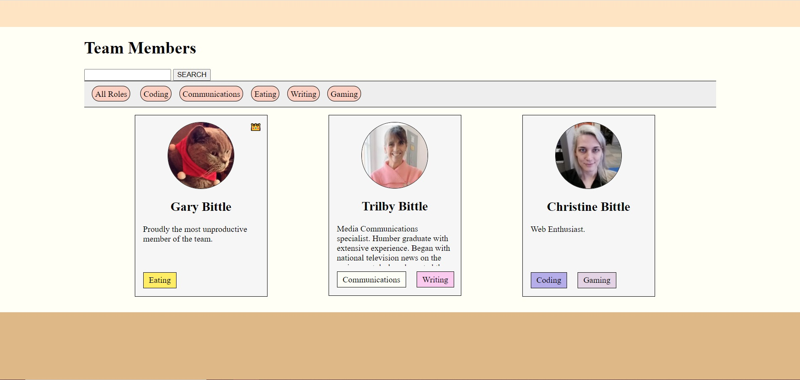

# About Us Page
An assignment simulating coding interview.

## description
Use pure JavaScript. No framework at all.
Use Promises().
This assignment makes me understand JavaScript better. Also, I get to know what I am capable to do within a time limit.

## screenshot

